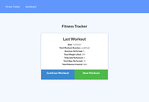

# Workout Tracker

## Description
This assignment is to create a workout tracker. Front end code has already been provided. The requirement is to create Mongo database with a Mongoose schema and handle routes with Express.

## User Story

* As a user, I want to be able to view create and track daily workouts. I want to be able to log multiple exercises in a workout on a given day. I should also be able to track the name, type, weight, sets, reps, and duration of exercise. If the exercise is a cardio exercise, I should be able to track my distance traveled.

## Business Context

A consumer will reach their fitness goals more quickly when they track their workout progress.

## Acceptance Criteria

When the user loads the page, they should be given the option to create a new workout or continue with their last workout.

The user should be able to:

  * Add exercises to the most recent workout plan.

  * Add new exercises to a new workout plan.

  * View the combined weight of multiple exercises from the past seven workouts on the `stats` page.

  * View the total duration of each workout from the past seven workouts on the `stats` page.

## Table

- [Installation](#installation)
- [Screenshot](#screenshot)
- [Website](#website)
- [Credits](#credits)
- [License](#license)

## Installation
Once pulled over from gitHub onto your local machine.
- First is to open up Microsoft Visual Studio Code.
    
- Then over on the side bar click ad folder to workspace
    
- Once you see on the files, to view in browser, right click index.html under workspace and then click Reveal in file explorer.
    
- Once the window comes up with the file. Just double click the file and the file will open up in the browser of your choice. 

## Screenshot/video link

   

## Credits
https://bootcamp.unh.edu/ 
  
https://coding-boot-camp.github.io/full-stack/github/professional-readme-guide
  
https://choosealicense.com/

http://www.heroku.com/

https://www.mongodb.com/

## Deployment
https://stormy-coast-28782.herokuapp.com/
    
## Repository
https://github.com/coreyNance/workout_tracker

## License

MIT License

Copyright (c)  2021  Corey Nance

Permission is hereby granted, free of charge, to any person obtaining a copy
of this software and associated documentation files (the "Software"), to deal
in the Software without restriction, including without limitation the rights
to use, copy, modify, merge, publish, distribute, sublicense, and/or sell
copies of the Software, and to permit persons to whom the Software is
furnished to do so, subject to the following conditions:

The above copyright notice and this permission notice shall be included in all
copies or substantial portions of the Software.

THE SOFTWARE IS PROVIDED "AS IS", WITHOUT WARRANTY OF ANY KIND, EXPRESS OR
IMPLIED, INCLUDING BUT NOT LIMITED TO THE WARRANTIES OF MERCHANTABILITY,
FITNESS FOR A PARTICULAR PURPOSE AND NONINFRINGEMENT. IN NO EVENT SHALL THE
AUTHORS OR COPYRIGHT HOLDERS BE LIABLE FOR ANY CLAIM, DAMAGES OR OTHER
LIABILITY, WHETHER IN AN ACTION OF CONTRACT, TORT OR OTHERWISE, ARISING FROM,
OUT OF OR IN CONNECTION WITH THE SOFTWARE OR THE USE OR OTHER DEALINGS IN THE
SOFTWARE.
